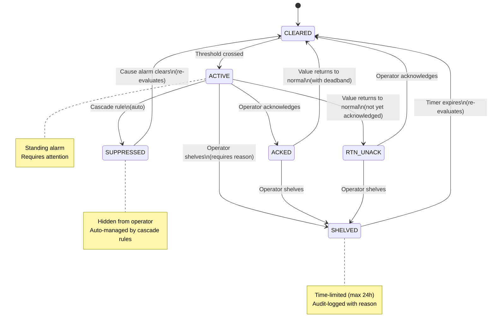
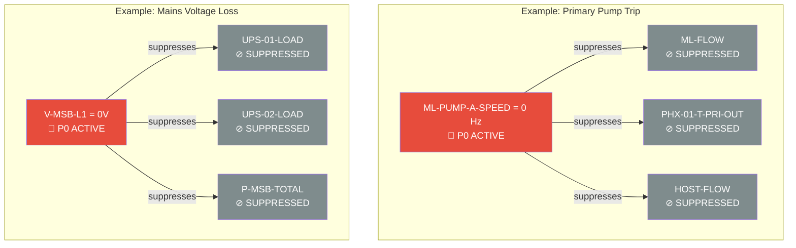

# Alarm Engine — ISA-18.2 Lifecycle Management

## Architecture

```
    Ingestion Service (Task 2)
        │
        ▼ Redis pub/sub (mcs:alarms:inbound)
        │
    ┌───┴────────────────────────────────────────────────────┐
    │                    ALARM ENGINE                         │
    │                                                         │
    │  ┌───────────┐   ┌──────────────┐   ┌──────────────┐  │
    │  │ Threshold  │──▶│ State Machine │──▶│  Cascade     │  │
    │  │ Evaluator  │   │ (ISA-18.2)   │   │  Suppressor  │  │
    │  └───────────┘   └──────┬───────┘   └──────────────┘  │
    │                         │                               │
    │  ┌───────────┐   ┌──────▼───────┐   ┌──────────────┐  │
    │  │ Shelve     │   │ Persistence  │──▶│  Event Log   │  │
    │  │ Manager    │   │ (DB write)   │   │  (immutable) │  │
    │  └───────────┘   └──────────────┘   └──────────────┘  │
    │                                                         │
    │  ┌──────────────────────────────────────────────────┐  │
    │  │ Redis pub/sub (mcs:alarms:outbound)              │  │
    │  │ → Stream D WebSocket → NOC dashboard alarm feed  │  │
    │  └──────────────────────────────────────────────────┘  │
    └─────────────────────────────────────────────────────────┘
```

## ISA-18.2 State Diagram



## Priority Definitions

| Priority | Name | Response Target | Use Case | Example |
|----------|------|----------------|----------|---------|
| **P0** | CRITICAL | Immediate | Safety risk, equipment protection, mode change | Coolant leak, UPS failure, critical overheat |
| **P1** | HIGH | 15 minutes | SLA impact, degraded operation | CDU flow loss, rack temp high, generator fuel low |
| **P2** | MEDIUM | 4 hours | Maintenance needed, trending toward failure | Glycol concentration drift, filter ΔP high |
| **P3** | LOW | Next business day | Informational, housekeeping | Switch CPU elevated, door open |

**ISA-18.2 target:** < 6 standing alarms per operator per hour.

## Threshold Configuration

Stored in `sensors.alarm_thresholds_json`:

```json
{
    "HH": {"value": 60.0, "priority": "P0", "delay_s": 0},
    "H":  {"value": 55.0, "priority": "P2", "delay_s": 30},
    "L":  {"value": 10.0, "priority": "P2", "delay_s": 30},
    "LL": {"value": 5.0,  "priority": "P0", "delay_s": 0}
}
```

| Level | Direction | Meaning |
|-------|-----------|---------|
| HH | HIGH | High-High — critical, immediate |
| H | HIGH | High — warning |
| L | LOW | Low — warning |
| LL | LOW | Low-Low — critical, immediate |

### Deadband Hysteresis

Prevents alarm chattering at threshold boundaries:

```
                    ┌─── Alarm raises at 55°C
                    │
    Value  ─────────┤   Alarm does NOT clear here (deadband zone)
                    │
                    └─── Alarm clears at 53.9°C (55 × 0.98 = 2% deadband)
```

**Default deadband:** 2% of threshold value. Configurable per-site.

### Debounce Delay

For noisy sensors, `delay_s` requires the value to exceed the threshold for N seconds before the alarm raises. Prevents transient spikes from generating nuisance alarms.

## Cascade Suppression Rules

When a root-cause alarm fires, downstream alarms are automatically suppressed:



### Default Cascade Rules

| Cause | Suppresses | Rationale |
|-------|------------|-----------|
| Primary pump trip (ML-PUMP-A/B) | Flow, PHX, host flow alarms | No pump → no flow. Operator should fix the pump, not chase 10 flow alarms |
| CDU pump trip | CDU flow, pressure diff, rack outlet temps | Same principle at the IT cooling loop level |
| Mains voltage loss (V-MSB) | UPS load, power meter alarms | UPS is doing its job. Operator focuses on restoring mains |
| Leak detection (LSH-01/02) | All flow and pressure alarms | Isolation valves closing causes expected flow/pressure transients |
| WAN/VPN loss | Switch alarms | Switches appear "failed" because they're unreachable, not broken |

When the cause clears, suppressed alarms are unsuppressed and re-evaluated.

## Shelving

Operators can temporarily suppress an alarm they're aware of:

- **Requires reason** (audit trail) — "Sensor calibration in progress", "Known issue, parts on order"
- **Maximum duration:** 24 hours (configurable)
- **Default duration:** 8 hours if not specified
- **Timer expiry:** alarm unshelves and re-evaluates
- **Audit logged:** who shelved, when, why, and when it unshelved

## Background Monitors

| Monitor | Interval | Purpose |
|---------|----------|---------|
| Shelve monitor | 5 min | Unshelve expired alarms |
| Stale alarm detector | 1 min | Clear alarms with no new readings for 30 min |
| Metrics logger | 30 sec | Log standing count, rates, ISA-18.2 compliance |

## File Structure

```
alarm_engine/
├── __init__.py
├── __main__.py           # Entry point: python -m alarm_engine
├── config.py             # ISA-18.2 states, priorities, cascade rules, tuning
├── state_machine.py      # AlarmInstance — per-alarm lifecycle management
├── threshold.py          # Threshold evaluation with deadband + debounce
├── cascade.py            # Cascade suppression engine
├── persistence.py        # Database read/write + immutable event logging
└── engine.py             # Main orchestrator — ties everything together
```

## Running

```bash
# As a Docker service (add to docker-compose.yml)
alarm-engine:
  build: .
  command: python -m alarm_engine
  depends_on:
    - timescaledb
    - redis
  environment:
    REDIS_URL: redis://redis:6379/0
    DB_HOST: timescaledb

# Standalone
python -m alarm_engine
```

## Redis Channels

| Channel | Direction | Publisher | Consumer |
|---------|-----------|-----------|----------|
| `mcs:alarms:inbound` | IN | Ingestion service (Task 2) | Alarm engine (this) |
| `mcs:alarms:outbound` | OUT | Alarm engine (this) | Stream D WebSocket → NOC dashboard |

### Outbound Message Format

```json
{
    "event": "alarm_raised",
    "alarm": {
        "id": 42,
        "sensor_id": 1234,
        "priority": "P0",
        "state": "ACTIVE",
        "tag": "CDU-01-T-RET",
        "subsystem": "thermal-l1",
        "site_id": "baldwinsville",
        "block_id": "block-01",
        "value_at_raise": 58.7,
        "raised_at": "2026-02-21T10:30:00Z",
        "threshold_value": 55.0,
        "threshold_direction": "HIGH"
    },
    "timestamp": "2026-02-21T10:30:00.123Z"
}
```

Event types: `alarm_raised`, `alarm_acked`, `alarm_cleared`, `alarm_rtn_unack`, `alarm_shelved`, `alarm_unshelved`, `alarm_suppressed`, `alarm_unsuppressed`

## REST API Interface (exposed via Task 5)

The alarm engine exposes methods for the REST API to call:

| Method | Endpoint | Description |
|--------|----------|-------------|
| `get_active_alarms()` | `GET /alarms` | Filtered list of non-cleared alarms |
| `acknowledge_alarm()` | `POST /alarms/{id}/acknowledge` | Operator acknowledges |
| `shelve_alarm()` | `POST /alarms/{id}/shelve` | Operator shelves with reason |

## What's Next

- **Task 5:** REST API skeleton — FastAPI endpoints consuming this engine
- **Task 6:** OpenAPI spec — the contract for Stream C and D
