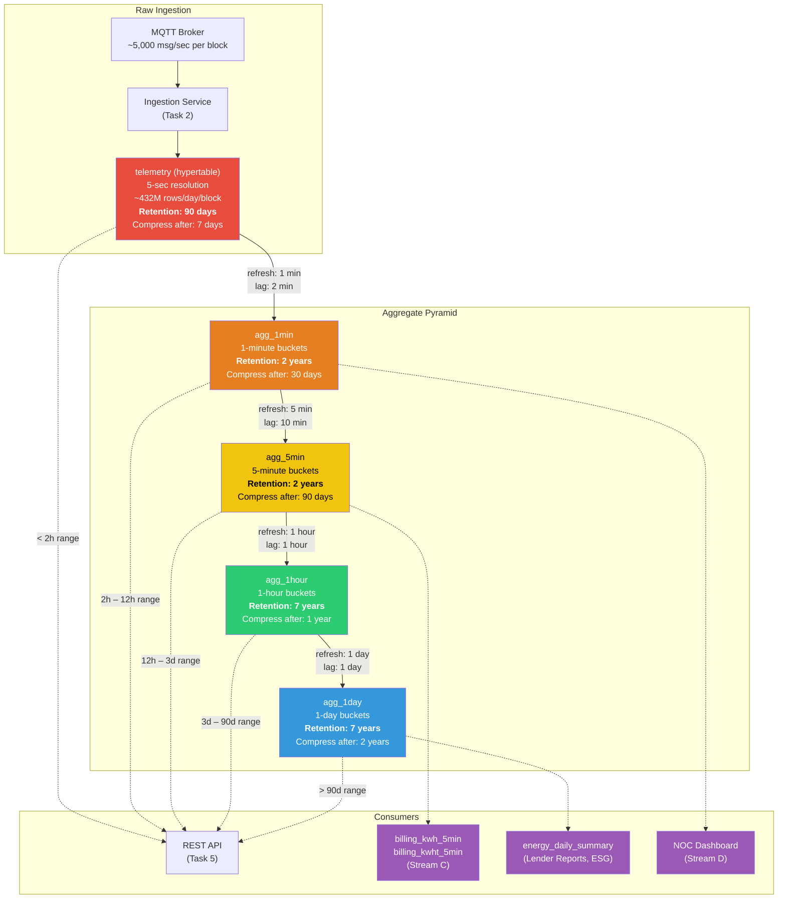
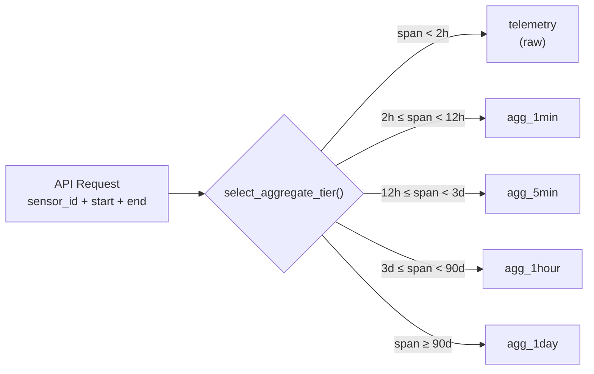
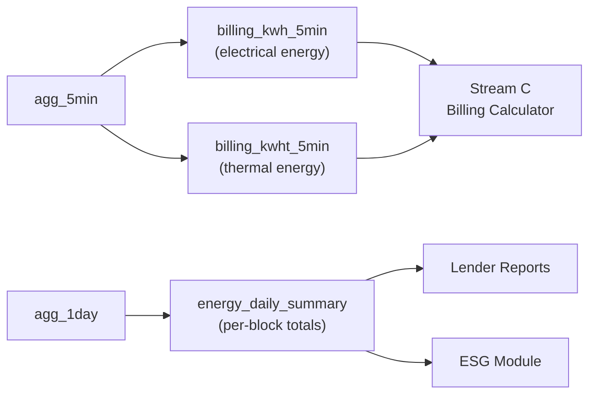

# Aggregate Architecture

## Data Flow Pyramid

## Query Routing Logic

## Storage Estimate (1MW Block, 300 sensors)

| Tier | Row Size | Daily Rows | Daily Storage | After Compression |
|------|----------|-----------|---------------|-------------------|
| Raw (5s) | ~40 bytes | ~432M | ~16 GB | ~1.6 GB (10:1) |
| 1-min | ~80 bytes | ~432K | ~33 MB | ~5 MB |
| 5-min | ~80 bytes | ~86K | ~7 MB | ~1 MB |
| 1-hour | ~80 bytes | ~7.2K | ~560 KB | ~90 KB |
| 1-day | ~80 bytes | ~300 | ~24 KB | ~4 KB |

**Total per block at retention limits:**
- Raw (90 days compressed): ~144 GB
- All aggregates (up to 7 years): ~25 GB
- **Total: ~170 GB per 1MW block**

**10MW site (10 blocks): ~1.7 TB** — well within a single TimescaleDB instance.

## Columns Stored Per Aggregate Row

| Column | Type | Purpose |
|--------|------|---------|
| `bucket` | timestamptz | Time bucket boundary |
| `sensor_id` | integer | FK to sensors table |
| `val_avg` | double precision | Average value in bucket |
| `val_min` | double precision | Minimum value in bucket |
| `val_max` | double precision | Maximum value in bucket |
| `val_last` | double precision | Last value (for "current" display) |
| `sample_count` | bigint | Number of raw readings |
| `val_stddev` | double precision | Standard deviation (anomaly detection) |
| `val_sum` | double precision | Sum (for energy counters) |
| `quality_good_ratio` | double precision | Fraction of GOOD quality samples |

## Billing Data Flow

## Design Decisions

1. **Hierarchical aggregates (not flat):** Each tier builds on the previous one, reducing computation. The 1-day aggregate never touches raw data — it reads from the 1-hour tier.

2. **`val_last` column:** Critical for dashboards showing "current value." Without it, you'd need to query raw data for the latest reading. `last(value, time)` is a TimescaleDB aggregate that efficiently tracks the most recent value.

3. **`val_sum` column:** Needed for energy counters (kWh, kWht) where the total over an interval matters, not just the average. Stream C's billing module relies on this.

4. **`quality_good_ratio`:** Propagated through all tiers so billing can flag intervals with degraded data quality. If quality drops below a threshold, Stream C can flag the invoice for manual review.

5. **Compression segmented by `sensor_id`:** TimescaleDB compresses by segment. Segmenting by sensor_id means queries for a single sensor decompress minimal data.

6. **2-minute refresh lag on 1-min aggregate:** Accounts for store-and-forward edge controllers that may deliver data with a delay after network reconnection.

7. **`query_telemetry()` function:** Single entry point for the REST API. Automatically selects the best tier based on the requested time range, or allows explicit tier override for billing precision.
