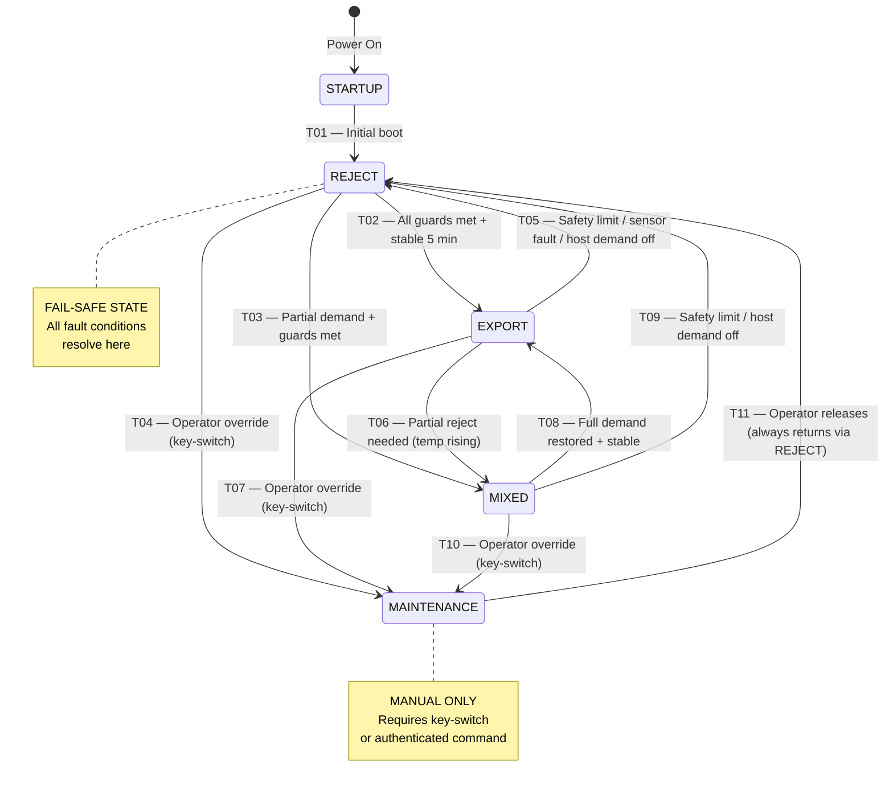

# MicroLink MCS — Thermal Mode State Machine

## Formal Specification v1.0.0

> **This state machine runs on the independent Safety PLC — NOT on the edge gateway.**
> It is hardwired to valve actuators and has no software dependency on the edge controller, cloud, or network.
> The edge gateway READS the current state via Modbus but NEVER WRITES mode commands directly to the PLC.
> Cloud-to-PLC commands go through a separate, authenticated command interface with physical key-switch override.

---

## 1. Governing Principle

**IT UPTIME > HEAT EXPORT — ALWAYS.**

If there is any doubt about the safety of the thermal system, the correct action is REJECT.
The dry cooler handles 100% of IT heat load. The host is never required for IT operation.
A brewery going offline must never cause a compute outage.

---

## 2. State Diagram



---

## 3. State Definitions

### 3.1 STARTUP (transient — <10 seconds)

**Purpose:** Power-on initialisation. PLC self-test, I/O scan, valve position verification.

| Attribute | Value |
|-----------|-------|
| Duration | <10 seconds (automatic) |
| V-EXP | CLOSED (verified) |
| V-REJ | CLOSED (verified) |
| Pumps | OFF |
| Dry cooler | OFF |
| PLC action | Self-test → verify all I/O → verify valve positions → transition T01 |

**Entry conditions:** PLC power-on or PLC restart after watchdog reset.
**Exit:** Automatic → REJECT via T01 after self-test passes.
**Failure:** If self-test fails → PLC holds STARTUP and sets fault register bit. Manual intervention required. Valves remain closed (spring-return to closed).

---

### 3.2 REJECT (fail-safe state)

**Purpose:** All heat rejected to dry cooler. No heat flows to host. IT cooling fully independent.

| Attribute | Value |
|-----------|-------|
| V-EXP | CLOSED (0%) |
| V-REJ | OPEN (100%) |
| PP-01 | RUNNING (auto-speed to maintain ΔT) |
| PP-02 | STANDBY (auto-start on PP-01 fault) |
| Dry cooler fans | RUNNING (modulate to maintain TT-DCout target) |
| Adiabatic spray | AUTO (activates if TT-AMB > 25°C) |
| HX | ISOLATED (no flow on primary side) |
| Host interface | ISOLATED (V-ISO-ML closed or no flow) |

**Monitoring priorities in this state:**
- Loop 2 supply temp (TT-L2s) — must stay in range with dry cooler as sole heat sink
- Dry cooler outlet temp (TT-DCout) — must achieve target return temp
- Ambient temp (TT-AMB) — if ambient > 35°C and dry cooler struggling, increase fan speed / spray
- Pump health (VIB-01, TT-PP01-brg)

**Exit conditions to EXPORT (T02):** See transition T02 below.
**Exit conditions to MIXED (T03):** See transition T03 below.
**Exit conditions to MAINTENANCE (T04):** Operator override only.

---

### 3.3 EXPORT (normal operation)

**Purpose:** All recoverable heat flows to host via plate HX. Dry cooler idle/standby.

| Attribute | Value |
|-----------|-------|
| V-EXP | OPEN (100%) |
| V-REJ | CLOSED (0%) |
| PP-01 | RUNNING |
| PP-02 | STANDBY |
| Dry cooler fans | STANDBY (0 rpm, ready to start in <30s) |
| Adiabatic spray | OFF |
| HX | ACTIVE (heat transfer to Loop 3) |
| Host interface | ACTIVE (V-ISO-ML open, host circulating) |

**Monitoring priorities in this state:**
- HX approach ΔT (TT-HX-approach) — rising approach = fouling, schedule maintenance
- Host demand signal (HOST-demand) — if host stops demanding, transition to REJECT
- Loop 2 supply temp (TT-L2s) — if rising above 52°C, host can't absorb heat → MIXED or REJECT
- Billing meter (MET-T1-kWt) — revenue tracking
- All safety sensors — any fault → immediate REJECT

**This is the revenue-generating state.** Maximise time in EXPORT.

---

### 3.4 MIXED (split flow)

**Purpose:** Partial heat to host, partial to dry cooler. Used when host demand < available heat, or when transitioning.

| Attribute | Value |
|-----------|-------|
| V-EXP | MODULATING (0-100%) |
| V-REJ | MODULATING (0-100%) — inverse of V-EXP |
| PP-01 | RUNNING |
| PP-02 | STANDBY |
| Dry cooler fans | RUNNING (modulate proportionally) |
| Adiabatic spray | AUTO |
| HX | ACTIVE (reduced flow) |
| Host interface | ACTIVE |

**Valve modulation logic (PID):**
- Control variable: TT-L2s (Loop 2 supply temp)
- Setpoint: 45°C (configurable)
- If TT-L2s rising → increase V-REJ opening (more heat to dry cooler)
- If TT-L2s falling → increase V-EXP opening (more heat to host)
- V-EXP% + V-REJ% ≈ 100% (not exactly — there's a small dead band to prevent hunting)
- PID tuning: Kp=2.0, Ki=0.5, Kd=0.1 (initial — tune during commissioning)

**Anti-hunting timer:** Valve position changes limited to once per 30 seconds minimum.

---

### 3.5 MAINTENANCE (manual isolation)

**Purpose:** System isolated for maintenance. No flow in any direction. Manual entry/exit only.

| Attribute | Value |
|-----------|-------|
| V-EXP | CLOSED (0%) |
| V-REJ | CLOSED (0%) |
| PP-01 | OFF (or running at minimum if flushing) |
| PP-02 | OFF |
| Dry cooler fans | OFF (or running if needed for cooldown) |
| HX | ISOLATED |
| Host interface | ISOLATED |

**Entry:** Requires operator authentication (key-switch on PLC panel OR authenticated cloud command with 2FA).
**Exit:** Operator releases → always transitions to REJECT first (never directly to EXPORT).
**Safety:** All monitoring continues. Leak detection remains active. P0 alarms still trigger.
**Audit:** Entry/exit logged with operator ID, timestamp, reason.

---

## 4. Transition Specifications

### T01: STARTUP → REJECT

| Attribute | Value |
|-----------|-------|
| Trigger | PLC self-test complete |
| Preconditions | All I/O modules responding. Valve position sensors reading. At least one pump available. |
| Guard conditions | None — unconditional after self-test |
| Actions | 1. Command V-REJ → OPEN. 2. Command V-EXP → CLOSED. 3. Start PP-01 at minimum speed. 4. Start dry cooler fans at minimum speed. 5. Begin monitoring. |
| Timeout | Self-test must complete within 10 seconds or fault |
| Post-conditions | V-REJ position confirmed OPEN. V-EXP confirmed CLOSED. Flow detected (FT-L2 > 0). |
| Confirmation | V-REJ-pos > 95% AND V-EXP-pos < 5% AND FT-L2 > 1 m³/h |

---

### T02: REJECT → EXPORT

| Attribute | Value |
|-----------|-------|
| Trigger | Automatic — all guards met and stable |
| Preconditions | System in REJECT for minimum 5 minutes (dwell timer) |
| Guard conditions | ALL must be TRUE simultaneously for ≥5 minutes: |
| | • TT-L2s > 40°C (sufficient heat to export) |
| | • TT-L2s < 52°C (not overheating) |
| | • HOST-demand = 1 (host is requesting heat) |
| | • HOST-hw-pump = 1 (host circulation active) |
| | • All safety sensors q = GOOD |
| | • No active P0 or P1 alarms |
| | • PT-L2s within 200-450 kPa (system pressure OK) |
| | • FT-L2 > 3 m³/h (adequate flow) |
| | • PLC-SAFE-faults = 0 (no PLC faults) |
| | • V-EXP-fault = 0 AND V-REJ-fault = 0 |
| Actions | 1. Command V-EXP → OPEN. 2. Wait for V-EXP-pos > 95%. 3. Command V-REJ → CLOSED. 4. Wait for V-REJ-pos < 5%. 5. Stop dry cooler fans (ramp down over 60s). 6. Publish mode state change. |
| Sequence timer | Steps 1-4 must complete within 60 seconds or abort → remain REJECT |
| Post-conditions | V-EXP confirmed OPEN. V-REJ confirmed CLOSED. TT-HXsOut > 35°C within 5 minutes (heat flowing). |
| Anti-repeat timer | If this transition fails, wait 10 minutes before re-attempting |

---

### T03: REJECT → MIXED

| Attribute | Value |
|-----------|-------|
| Trigger | Automatic — partial demand detected |
| Preconditions | Same as T02 EXCEPT host demand may be partial (HOST-demand = 1 but TT-HOST-hw-tank > 55°C indicating tank nearly full) |
| Guard conditions | Same as T02 except TT-L2s threshold relaxed to > 38°C |
| Actions | 1. Command V-EXP → 50% (initial). 2. Command V-REJ → 50%. 3. Engage PID controller for valve modulation. 4. Reduce dry cooler fans proportionally. |
| Post-conditions | Both valves confirmed at commanded positions ±10%. Flow detected through both paths. |

---

### T04: REJECT → MAINTENANCE

| Attribute | Value |
|-----------|-------|
| Trigger | Operator override — key-switch or authenticated command |
| Preconditions | Operator physically present (key-switch) or 2FA authenticated command |
| Guard conditions | None — operator can enter MAINTENANCE from any safe state |
| Actions | 1. Confirm V-EXP CLOSED. 2. Confirm V-REJ CLOSED. 3. Ramp down pumps (over 30s, don't hard-stop). 4. Stop dry cooler fans. 5. Log operator ID, timestamp, stated reason. |
| Post-conditions | All valves closed. Pumps stopped (or at minimum for flushing if requested). |
| Operator acknowledgement | PLC requires operator to confirm "MAINTENANCE ENTERED" on HMI or via command response |

---

### T05: EXPORT → REJECT (Emergency)

| Attribute | Value |
|-----------|-------|
| Trigger | ANY of these conditions: |
| | • Any P0 alarm raised |
| | • Any safety sensor q = BAD for > 5 seconds |
| | • TT-L2s > 55°C (thermal limit) |
| | • TT-L2s < 30°C (unexpected cooling — possible flow reversal) |
| | • HOST-demand = 0 (host stopped requesting heat) |
| | • HOST-hw-pump = 0 (host stopped circulating) |
| | • FT-L2 < 2 m³/h (low flow — blockage or pump issue) |
| | • PT-L2s > 450 kPa OR < 100 kPa (pressure anomaly) |
| | • V-EXP-fault = 1 (export valve not responding) |
| | • LD-* any leak detector triggered |
| | • PLC-SAFE-watchdog stale > 5 seconds |
| | • PLC-SAFE-faults ≠ 0 |
| Preconditions | None — emergency transitions have no preconditions |
| Guard conditions | None — emergency transitions bypass all guards |
| Actions | 1. IMMEDIATELY command V-REJ → OPEN. 2. IMMEDIATELY command V-EXP → CLOSED. 3. Start dry cooler fans at 100%. 4. Publish alarm event. 5. Publish mode state change with trigger detail. |
| Timing | V-REJ must begin opening within 500ms of trigger. Full open within 15 seconds. |
| Post-conditions | V-REJ confirmed OPEN. Dry cooler running. IT cooling restored via reject path. |
| Recovery | System remains in REJECT until T02 guards are met again + 5 min dwell |

**CRITICAL:** This is the most important transition. It must be unconditional, immediate, and reliable. The Safety PLC processes this transition in its fastest scan cycle (typically 10-50ms). No software, network, or operator input required.

---

### T06: EXPORT → MIXED

| Attribute | Value |
|-----------|-------|
| Trigger | TT-L2s rising above 48°C (approaching limit, but not yet emergency) |
| Preconditions | Currently in EXPORT for > 2 minutes (prevent oscillation on startup) |
| Guard conditions | TT-L2s > 48°C for > 30 seconds sustained (not a spike) |
| Actions | 1. Command V-REJ → 25% (initial partial opening). 2. Command V-EXP → 75%. 3. Engage PID modulation. 4. Start dry cooler fans at proportional speed. |
| Purpose | Graceful degradation — shed excess heat to dry cooler without losing all export |

---

### T07: EXPORT → MAINTENANCE

| Attribute | Value |
|-----------|-------|
| Trigger | Operator override |
| Actions | Same as T04. Ramp down gracefully — close V-EXP first, verify flow stops to host, then close V-REJ, then stop pumps. |
| Extra step | Notify host BMS that heat export is stopping (if BACnet write is permitted) |

---

### T08: MIXED → EXPORT

| Attribute | Value |
|-----------|-------|
| Trigger | Automatic — conditions improved |
| Preconditions | In MIXED for > 5 minutes (dwell) |
| Guard conditions | TT-L2s < 45°C for > 3 minutes sustained. All T02 guards met. |
| Actions | 1. Ramp V-EXP → 100% over 60 seconds. 2. Ramp V-REJ → 0% correspondingly. 3. Stop dry cooler fans (ramp down). |

---

### T09: MIXED → REJECT

| Attribute | Value |
|-----------|-------|
| Trigger | Same emergency triggers as T05, PLUS: V-EXP modulated to < 10% for > 5 minutes (host taking almost no heat — just go full reject) |
| Actions | Same as T05 — immediate. |

---

### T10: MIXED → MAINTENANCE

| Attribute | Value |
|-----------|-------|
| Trigger | Operator override |
| Actions | Same as T04 |

---

### T11: MAINTENANCE → REJECT

| Attribute | Value |
|-----------|-------|
| Trigger | Operator releases maintenance mode |
| Preconditions | Operator confirms "MAINTENANCE COMPLETE" on HMI or via command |
| Guard conditions | V-EXP confirmed CLOSED. V-REJ confirmed CLOSED. No active P0 alarms. |
| Actions | 1. Command V-REJ → OPEN. 2. Start PP-01 at minimum speed. 3. Ramp up to operational speed over 60s. 4. Start dry cooler fans. 5. Begin monitoring. 6. Log maintenance end. |
| Post-conditions | Normal REJECT state. System may then transition to EXPORT via T02 if guards met. |
| NEVER | Never transition directly from MAINTENANCE to EXPORT. Always go through REJECT for system stabilisation. |

---

## 5. Timer Specifications

| Timer | Duration | Purpose |
|-------|----------|---------|
| T_DWELL_REJECT | 5 min | Minimum time in REJECT before allowing transition to EXPORT/MIXED |
| T_DWELL_EXPORT | 2 min | Minimum time in EXPORT before allowing transition to MIXED |
| T_DWELL_MIXED | 5 min | Minimum time in MIXED before allowing transition to EXPORT |
| T_GUARD_STABLE | 5 min | All guards must be TRUE for this duration before REJECT→EXPORT |
| T_GUARD_MIXED_STABLE | 3 min | Guards for MIXED→EXPORT stability check |
| T_VALVE_TIMEOUT | 60 s | Max time for valve to reach commanded position. Exceeded → valve fault. |
| T_VALVE_FAST | 15 s | Max time for emergency valve transition (T05). Exceeded → P0. |
| T_ANTI_HUNT | 30 s | Minimum time between valve position changes in MIXED mode (PID output) |
| T_ANTI_REPEAT | 10 min | After failed REJECT→EXPORT attempt, wait before retrying |
| T_SENSOR_FAULT | 5 s | Sensor quality=BAD sustained before triggering emergency transition |
| T_SUSTAINED_TEMP | 30 s | Temperature alarm condition must sustain before T06 trigger (debounce) |
| T_HEARTBEAT_WD | 5 s | PLC watchdog timeout. If PLC scan counter stale → P0 + REJECT. |
| T_PUMP_RAMP | 60 s | Pump speed ramp-up/ramp-down duration (VFD acceleration time) |
| T_FAN_RAMP | 30 s | Dry cooler fan ramp-up/ramp-down duration |
| T_MAINTENANCE_MAX | 8 h | Maximum time in MAINTENANCE without re-confirmation. Auto-alert at 4h. |

---

## 6. Failure Mode Table

### 6.1 Sensor Failures

| Failed Sensor | Detection | Immediate Action | Resulting State |
|---------------|-----------|-----------------|-----------------|
| TT-L2s (supply temp) | q=BAD for >5s | Cannot verify thermal safety → emergency | → REJECT via T05 |
| TT-L2r (return temp) | q=BAD for >5s | Cannot calculate ΔT → emergency | → REJECT via T05 |
| FT-L2 (flow) | q=BAD for >5s | Cannot verify circulation → emergency | → REJECT via T05 |
| PT-L2s (pressure) | q=BAD for >30s | Degraded monitoring. Continue if other sensors OK. | Remain + P1 alarm |
| TT-HXpIn (HX primary in) | q=BAD for >30s | Cannot verify HX performance → degrade to MIXED | → MIXED (reduce export) |
| TT-HXsOut (HX export temp) | q=BAD for >30s | Cannot verify host export quality → MIXED | → MIXED |
| FT-BIL (billing flow) | q=BAD for >30s | Billing impacted but not safety | Remain + P2 alarm + flag billing period |
| HOST-demand (BMS signal) | q=BAD for >60s | Assume no demand (safe assumption) | → REJECT via T05 |
| Any LD-* (leak) | q=BAD for >5s | Cannot verify no-leak → assume leak | → REJECT via T05 + P0 |
| TT-FREEZE-* | q=BAD for >5s | Cannot verify freeze safety | Remain + P1 + activate trace heating |
| VIB-01 (pump vibration) | q=BAD for >60s | Pump health unknown | Remain + P2 + schedule inspection |
| TT-AMB (ambient) | q=BAD for >60s | Cannot optimise dry cooler | Remain + P3 + run fans at fixed high speed |

**Redundancy strategy:** Critical sensors (TT-L2s, FT-L2) should have redundant instruments. In point schedule v2, add TT-L2s-R (redundant) and FT-L2-R. PLC uses voting logic: if primary and redundant disagree → use lower value (conservative) + P1 alarm.

### 6.2 Valve Failures

| Failed Valve | Detection | Immediate Action | Resulting State |
|--------------|-----------|-----------------|-----------------|
| V-EXP won't open | Position ≠ command for >T_VALVE_TIMEOUT | Can't export → remain REJECT | Stay REJECT + P1 alarm |
| V-EXP won't close | Position ≠ command for >T_VALVE_FAST | Heat flowing to host uncontrolled → P0 | → REJECT + stop pumps if needed |
| V-REJ won't open | Position ≠ command for >T_VALVE_FAST | CAN'T REJECT HEAT — CRITICAL | → P0 + emergency pump stop + alert |
| V-REJ won't close | Position ≠ command for >T_VALVE_TIMEOUT | Heat leaking to dry cooler — efficiency loss, not safety | Remain + P2 alarm |
| V-EXP stuck mid-position | Position stable but ≠ command | Uncontrolled split flow | → REJECT + P1 alarm |
| V-REJ stuck mid-position | Position stable but ≠ command | Partial rejection still works | Remain + P1 + monitor temps closely |

**Spring-return valves:** V-REJ SHOULD be specified as spring-return-to-OPEN. On loss of power or signal, the reject valve physically opens. This is the hardware fail-safe.

**V-EXP should be spring-return-to-CLOSED.** On loss of power, export stops. Combined: loss of all power → V-EXP closes + V-REJ opens → safe reject state with no electricity required.

### 6.3 Equipment Failures

| Failed Equipment | Detection | Immediate Action | Resulting State |
|-----------------|-----------|-----------------|-----------------|
| PP-01 (duty pump) trips | PP01-status = 0 OR PP01-fault ≠ 0 | Auto-start PP-02 (standby) | Remain in current state + P1 alarm |
| PP-02 (standby) trips while running | PP02-status = 0 | No pump available → emergency | → REJECT + P0 + emergency pump stop protocol |
| Both pumps fail | Both status = 0 | No circulation — thermal runaway risk | → REJECT + P0 + IT load shed if temps rise |
| Dry cooler fans fail (1 of 4) | DC01-fan-fault bit set | Reduced rejection capacity — manageable | Remain + P2 + increase remaining fan speeds |
| Dry cooler fans fail (2+ of 4) | Multiple fault bits | Significantly reduced capacity | → REJECT + P1 + may need MIXED to use HX as supplemental |
| All dry cooler fans fail | All fault bits set | Cannot reject any heat | → P0 + MAINTENANCE + IT load shed sequence |
| HX fouling (gradual) | TT-HX-approach rising above 10°C | Reduced export efficiency | Remain + P2 alarm + schedule CIP cleaning |
| HX catastrophic failure | Sudden pressure/flow anomaly | Possible cross-contamination | → REJECT + P0 + close V-ISO-ML + close V-ISO-HOST |
| PLC power failure | PLC-SAFE-status = 0 for >T_HEARTBEAT_WD | Spring-return valves activate (hardware fail-safe) | → REJECT (hardware) + P0 alarm from edge |
| Edge gateway failure | No heartbeat for >90s | PLC continues independently — edge not needed for safety | PLC continues normal operation. Cloud loses visibility. |

### 6.4 Communication Failures

| Failure | Detection | Impact | Action |
|---------|-----------|--------|--------|
| Edge ↔ PLC Modbus lost | Read timeout | Edge can't report PLC state to cloud | Edge publishes q=BAD for mode sensors. PLC operates independently. |
| Edge ↔ Cloud MQTT lost | Heartbeat not delivered | Cloud blind to site. No remote monitoring. | Edge buffers locally. PLC operates independently. Safety unaffected. |
| PLC ↔ BMS BACnet lost | HOST-bms-online = 0 | Can't read host demand signal | Assume HOST-demand = 0 → REJECT (conservative). |
| PLC ↔ I/O module lost | I/O module timeout | Sensor group goes BAD | Depends on which sensors — see sensor failure table. |
| All comms lost | No Modbus, no BACnet | PLC relies on hardwired signals only | Hardwired leak detectors + temp switches still trigger REJECT. |

---

## 7. Startup Sequence

Complete startup sequence from cold (unpowered) to EXPORT:

```
T=0        PLC powers on
           └─ Self-test: CPU, I/O, memory, watchdog
T=0+5s     Self-test complete → T01 → REJECT
           ├─ V-REJ → OPEN (spring-return confirms)
           ├─ V-EXP → CLOSED (spring-return confirms)
           └─ Dry cooler fans → minimum speed
T=0+10s    Start PP-01 at 20% speed
           └─ Ramp to target speed over T_PUMP_RAMP (60s)
T=0+70s    Pump at operational speed
           ├─ FT-L2 confirms flow > 3 m³/h
           ├─ PT-L2s confirms pressure in range
           └─ Begin thermal stabilisation
T=0+2min   IT load begins generating heat
           └─ TT-L2s begins rising from ambient
T=0+5min   TT-L2s approaches 40°C
           └─ Guard evaluation begins
T=0+10min  TT-L2s > 40°C sustained for 5 minutes
           ├─ HOST-demand = 1 (host requesting heat)
           ├─ All safety sensors GOOD
           └─ All guards TRUE for T_GUARD_STABLE (5 min)
T=0+15min  T02 triggers → REJECT → EXPORT
           ├─ V-EXP → OPEN (confirm within T_VALVE_TIMEOUT)
           ├─ V-REJ → CLOSED
           ├─ Dry cooler fans ramp down
           └─ Heat flowing to host. Revenue begins.
```

**Typical cold start to EXPORT: ~15 minutes.**
**Typical warm restart to EXPORT: ~7 minutes** (system already at temp).

---

## 8. Override Handling

### 8.1 Operator Override to REJECT

| Attribute | Value |
|-----------|-------|
| Access | Key-switch on PLC panel OR authenticated cloud command |
| Authentication (cloud) | JWT with `operator` role + 2FA confirmation |
| Effect | Immediate transition to REJECT from any state |
| Duration | Indefinite until operator releases |
| Audit | Logged: operator_id, timestamp, reason (required field), source (local/remote) |
| Auto-guards | While override active, auto-transitions to EXPORT/MIXED are suppressed |
| Release | Operator explicitly releases. System enters normal REJECT with standard T02 guards. |

### 8.2 Operator Override to MAINTENANCE

| Attribute | Value |
|-----------|-------|
| Access | Key-switch only (cloud command available but must be explicitly enabled per site) |
| Effect | Graceful shutdown of all flow → MAINTENANCE state |
| Duration | Max T_MAINTENANCE_MAX (8 hours). Alert at 4h. Auto-release at 8h → REJECT. |
| Audit | Logged with reason, planned duration, work order number (optional) |
| Safety | Leak detection and temperature monitoring remain active throughout |

### 8.3 Override Hierarchy

1. **Hardware key-switch** — highest priority. Overrides everything including cloud commands.
2. **Safety PLC internal** — P0 conditions always force REJECT regardless of any override.
3. **Authenticated cloud command** — lowest override priority. Can be overridden by key-switch or safety PLC.

---

## 9. Alarm Integration

The mode state machine generates these alarms:

| Condition | Priority | Alarm Tag | Description |
|-----------|----------|-----------|-------------|
| Any leak detected | P0 | ALM-LEAK-{zone} | Immediate REJECT + isolate |
| V-REJ won't open | P0 | ALM-VREJ-FAULT | Cannot reject heat — critical |
| Both pumps failed | P0 | ALM-PUMP-NONE | No circulation |
| PLC fault | P0 | ALM-PLC-FAULT | Safety PLC not operational |
| PLC watchdog timeout | P0 | ALM-PLC-WD | PLC scan frozen |
| TT-L2s > 55°C | P0 | ALM-L2-OVTEMP | Thermal runaway risk |
| V-EXP won't close | P0 | ALM-VEXP-STUCK | Uncontrolled host flow |
| Forced to REJECT from EXPORT | P1 | ALM-MODE-EMRG | Emergency mode change |
| Single pump trip (standby running) | P1 | ALM-PUMP-TRIP | Running on standby |
| HOST-demand lost during EXPORT | P1 | ALM-HOST-LOST | Host stopped requesting |
| Sensor fault (critical sensor) | P1 | ALM-SENSOR-{tag} | Critical sensor BAD |
| V-EXP won't open | P1 | ALM-VEXP-FAULT | Cannot export (not safety critical) |
| HX approach ΔT > 10°C | P2 | ALM-HX-FOUL | Schedule cleaning |
| Pump vibration high | P2 | ALM-VIB-{pump} | Bearing wear |
| Dry cooler fan fault (1 of 4) | P2 | ALM-DC-FAN | Reduced capacity |
| Billing meter fault | P2 | ALM-BIL-FAULT | Revenue tracking impaired |
| Multiple mode transitions in 1 hour | P3 | ALM-MODE-HUNT | Possible instability |
| Maintenance timer warning (4h) | P3 | ALM-MAINT-WARN | Maintenance duration |

---

## 10. PLC Hardware Specification

| Attribute | Requirement |
|-----------|-------------|
| Platform | Allen-Bradley CompactLogix L33ER or Siemens S7-1500 F-series (safety-rated) |
| Safety rating | SIL 2 minimum (IEC 61508) for valve control outputs |
| Scan time | < 50ms for safety program, < 100ms for standard program |
| I/O | 32 DI, 16 DO, 16 AI (4-20mA), 4 AO (4-20mA) minimum |
| Modbus | Modbus TCP server (for edge gateway reads) on dedicated Ethernet port |
| HMI | Small local touchscreen (4-7") for mode display, override, alarm ack |
| Power | 24VDC with UPS-backed supply (minimum 30 minutes battery for graceful shutdown) |
| Environment | -20°C to 60°C operating (outdoor rated for Baldwinsville) |
| Certifications | UL 508A, CE, IEC 61131-3 compliant programming |

**Programming language:** Structured Text (IEC 61131-3) for state machine logic. Ladder Diagram for hardwired interlocks and valve control.

---

## 11. Hardwired Interlocks (Independent of PLC Software)

These interlocks function even if the PLC software crashes:

| Interlock | Trigger | Action | Implementation |
|-----------|---------|--------|---------------|
| IL-01: Emergency stop | Physical E-stop button pressed | All pumps stop. Valves spring-return. | Hardwired relay. Breaks pump contactor power. |
| IL-02: Leak — pump stop | Any leak detector rope/spot | Stop all pumps within 2 seconds | Hardwired relay from leak detector to pump contactor |
| IL-03: Over-pressure | PT-L2s > 500 kPa (mechanical PRV) | PRV opens mechanically | Mechanical spring-loaded PRV. No electronics. |
| IL-04: Over-temp shutdown | TT-L2s > 65°C (bimetallic switch) | Stop pumps + open V-REJ | Bimetallic temp switch hardwired to relay |
| IL-05: V-REJ spring-return | Loss of valve actuator power | V-REJ opens mechanically | Spring-return actuator. Fails OPEN. |
| IL-06: V-EXP spring-return | Loss of valve actuator power | V-EXP closes mechanically | Spring-return actuator. Fails CLOSED. |

These interlocks are the **last line of defence**. They operate without electricity (except the pump contactor break). They are tested during commissioning Phase 6 and annually thereafter.

---

## 12. Commissioning Verification

During commissioning Phase 6 (Mode State Testing), the following must be verified:

| Test | Method | Pass Criteria |
|------|--------|---------------|
| T01: STARTUP→REJECT | Power cycle PLC | V-REJ opens, V-EXP stays closed, pumps start, within 60s |
| T02: REJECT→EXPORT | Wait for guards + dwell | V-EXP opens, V-REJ closes, heat appears at HX secondary |
| T05: EXPORT→REJECT (emergency) | Simulate TT-L2s > 55°C via test input | V-REJ opens within 15s, V-EXP closes, dry cooler starts |
| T05: Leak detection → REJECT | Trigger test leak on each zone | Mode → REJECT within 2s per zone |
| T05: Host demand loss → REJECT | Toggle HOST-demand to 0 | Mode → REJECT within 5s |
| IL-01: E-stop | Press E-stop | Pumps stop within 2s. Valves spring-return. |
| IL-02: Hardwired leak interlock | Trigger leak with PLC software stopped | Pumps stop within 2s. |
| IL-05/06: Spring-return test | Remove valve actuator power | V-REJ opens, V-EXP closes, within 30s |
| Sensor fault → REJECT | Disconnect TT-L2s | Mode → REJECT within 10s |
| Valve fault detection | Mechanically block V-EXP | Fault detected within T_VALVE_TIMEOUT, P0 raised |
| Anti-hunting | Rapidly cycle HOST-demand | Mode changes limited by dwell timers, no oscillation |
| Override test | Activate key-switch → MAINTENANCE → release | Correct transitions, audit log entries, REJECT on release |
| PLC watchdog | Pause PLC program (test mode) | Watchdog P0 within T_HEARTBEAT_WD |

All tests recorded with pass/fail, operator name, date, and archived as commissioning evidence.

---

*This specification is the authoritative source for all mode state behaviour. The Safety PLC programmer implements exactly this logic. Any deviation requires engineering review and revision of this document.*
